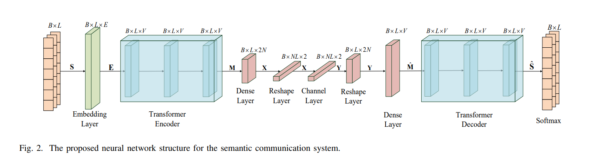
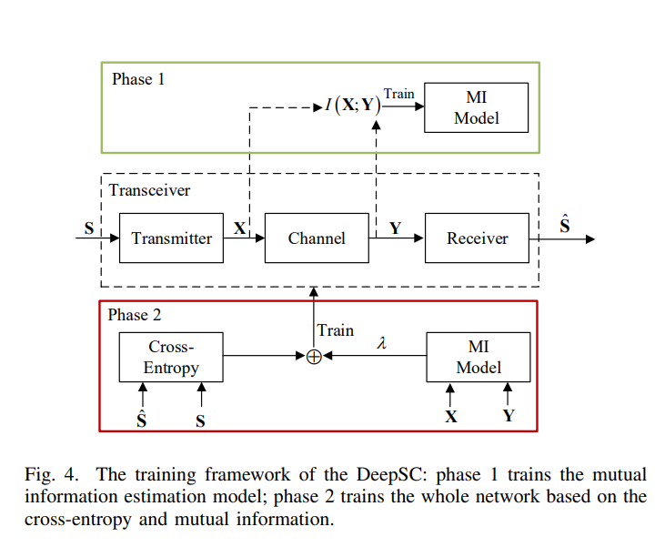

## Projet de stage – Communications Sémantiques avec Apprentissage Profond
Ceci est une implémentation du système Deep Learning Enabled Semantic Communication Systems.

## Prérequis
Consultez le fichier requirements.txt pour la liste des bibliothèques Python nécessaires, puis installez-les avec la commande suivante :
```shell
pip install -r requirements.txt
```
  
## Prétraitement des données
Les données utilisées sont des fichiers .txt en anglais issus des débats du Parlement européen (corpus Europarl).

Le script preprocess_text.py nettoie les textes, filtre les phrases, et transforme les données en formats .pkl et .json (encodage des phrases et vocabulaire).
Le fichier check_data.py permet d’explorer les fichiers générés dans data/.

```shell
python preprocess_text.py
```
## Entraînement du modèle DeepSC
Cette phase lance l’entraînement du modèle DeepSC (Deep Semantic Communication).
Deux architectures principales ont été utilisées (voir les captures ci-dessous), tirées du papier de référence Deep Learning Enabled Semantic Communication Systems (Xie et al., 2021).





L’entraînement a été réalisé avec deux types de canaux : AWGN (bruit additif gaussien) et Rayleigh (canal à fading).

Les modèles entraînés sont automatiquement enregistrés dans le dossier checkpoints/.

```shell
python main.py
```
## Evaluation du modèle DeepSC
Lors de cette phase, le modèle est évalué à l’aide de deux métriques principales : le score BLEU et la similarité de phrases.

```shell
python bleu_score_evaluation.py
python sentence_similarity_evaluation.py
```

